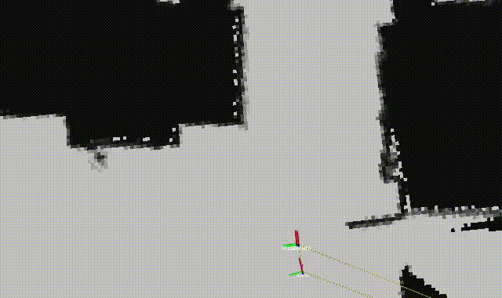

# Robot Programming: DMapLocalizer 

A ROS-based distance map ICP localizer. Developed for the Robot Programming course at Sapienza University of Rome.

 *<!-- Add a GIF/screenshot of your simulation in action -->*

## Overview
This project implements a **distance-map-based ICP localizer** that:
- Uses iterative odometry estimation for initial pose guesses
- Simulates odometry noise for evaluation

### Key Components
| Node                     | Description                                                                 |
|--------------------------|-----------------------------------------------------------------------------|
| `DmapLocalizerNode`      | Refines `map` → `odom` transform using scan/map data and odometry           |
| `ScanNode`               | Generates simulated LiDAR scans from ground-truth robot pose               |
| `RobotControllerNode`    | Simulates noisy odometry by injecting systematic/Gaussian noise to wheel commands |

## Prerequisites, Building and Running
- ROS Noetic
- TurtleBot3 ( `turtlebot3_teleop`)
- [nav_msgs](http://wiki.ros.org/nav_msgs), [tf2](http://wiki.ros.org/tf2)

```bash
sudo apt-get install ros-noetic-turtlebot3 ros-noetic-navigation

# Build with catkin
catkin_make

# Make setup executable
chmod +x setup.sh
# Source and run everything
./setup.sh
```
From Rviz add map (displays the Occupancy grid) and display the tf transform hierarchy. set initial pose in the non-occupied grid and through turtle bot terminal, control velocity commands with the appropriate keys.


